# PPO_BMSTU
## Название проекта

Администрирование парусных гонок.

## Краткое описание идеи проекта

С целью структурирования и организации доступа к результатам соревнований по парусному спорту необходимо создать приложение, которое обеспечит: добавление участников, организацию данных о результатах гонок, протестах, составление рейтинга.

## Краткое описание предметной области

Соревнования по парусному спорту проходят в течение n дней, в каждый из которых проводится по m гонок. Порядок финиширования яхт каждого класса фиксируется представителем судейского комитета: номер прихода - количество присваеваемых баллов. По полученным данным составляется таблица и подводятся итоги: чем меньше баллов в сумме, тем выше рейтинг участника. Кроме того, финишируя спортсмены могут подать "протест" на своих оппонентов.

## Краткий анализ аналогичных решений по минимум 3 критериям

|Решенине\Критерий| наличие информации о протестах | возможность просмотра рейтинга участниками | создание рейтинга произвольной конфигурации и подсчет результатов согласно ППГ 2021-2024 | гонки с пересадкой, флотов, крейсерские |
|-|--------|--------|--------|--------|
| SailingRaces | - | - | + | + |
| предлагаемое решение | + | + | + | - |

## Краткое обоснование целесообразности и актуальности проекта

В настоящее время мощный импульс развития получил парусный спорт вследствие того, что данная дисциплина практически не предполагает возрастных ограничений. Актуальность данной темы обоснована тем, что спортсмены повышают свой уровень, учавствуя в соревнованиях и нуждаются в эффективных механизмах анализа динамики гонок. Существует приложение для создания рейтинга, однако в нем полностью отсутствует возможность просматра участниками таблицы результатов и информации о протестах. Разработанное приложение должно упростить получение актуальных данных спортсменами.

## Краткое описание акторов (ролей)

В проекте определены следующие роли:

- зритель - люди, которые хотят просмотреть рейтинги регаты;
- судья - люди из судейского комитета, которые добавляют участников соревнований, экипажи; созданют и изменяют данные, доступные для зрителя: рейтинги, информацию о протестах.

## Use-Case - диаграмма

  

## ER-диаграмма сущностей

  

## Пользовательские сценарии

1. Участник просматривает рейтинговую таблицу.
- открывает сайт;
- переходит на вкладку с рейтингом;
- переходит на вкладку с рейтингом класса яхт "Луч";
- в качестве фильтра выбирает результаты в зачете юношей; 
- просматривает содержимое рейтинга. 

2. Судья принимает финиш.
- заходит в систему;
- переходит на вкладку первого дня;
- переходит на вкладку класса яхт "Оптимист"; 
- переходит ко второй гонке;
- переходит на вкладку приема финиша;
- фиксирует номера парусов, пересекших финишную черту по порядку;
- по окончании приема финиша запускает процесс конвертации данных из составленного списка финишировавших лодок в баллы каждой яхты в рейтинге;
- обновление рейтинга.

3. Судья создает протест
- заходит в систему;
- переходит на вкладку четвертого дня;
- переходит на вкладку класса яхт "Кадет";
- переходит на вкладку десятой гонки; 
- переходит на вкладку списка протестов;
- создает новый протест, фиксируя номер нарушенного правила, номер яхты, которая подала протест, номер опротестованной яхты, номера яхт - свидетелей;
- обновляется список протестов;
- переход на вкладкку списка протестов.

4. Судья создает участника.
- заходит в систему;
- переходит на вкладку участников;
- проверяет наличие и валидность документов отправленных участником: 
- добавляет нового участника, внося его ФИО, 

5. Судья изменяет количество выбрасываемых результатов
- заходит в систему, авторизуясь;
- переходит на вкладку рейтинга нужного класса яхт;
- увеличивает количество результатов, которые не учитываются в зачете на 1;
- рейтинг обновляется;
- отображается обновленный рейтинг.

## Формализация ключевых бизнес-процессов

 
  
  

