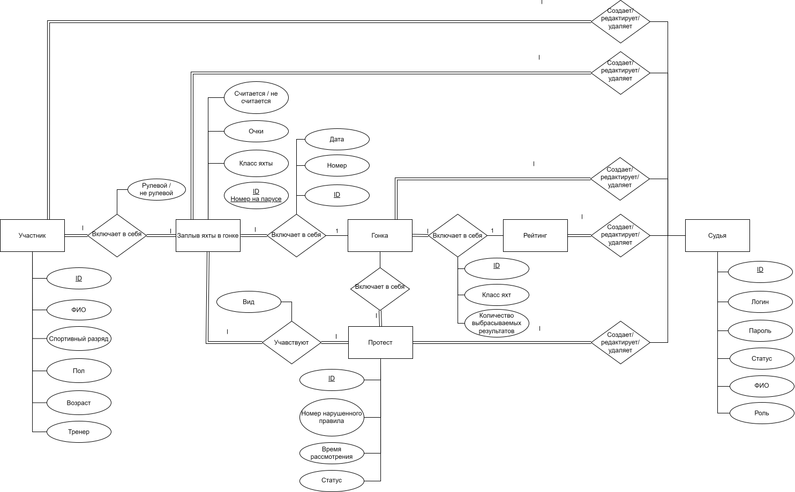

# PPO_BMSTU
## Название проекта

Администрирование парусных гонок.

## Краткое описание идеи проекта

Соревнования по парусному спорту проходят в n дней, в каждый из которых проводится по m гонок. Порядок финиширования яхт каждого класса фиксируется представителем судейского комитета: номер прихода - количество присваеваемых баллов. По полученным данным составляется таблица и подводятся итоги: чем меньше баллов в сумме, тем выше рейтинг.

Необходимо создать приложение, чтобы упростить процесс проведения соревнований: реализовать БД, предоставить возможность наполнять ее данными и производить операции над ними посредством интерфейса приложения.

## Краткое описание предметной области

Предметная область - соревнования по парусному спорту: регистрация участников, добавление данных о результатах гонок, протестах, составление и сортировка рейтинга.

## Краткий анализ аналогичных решений по минимум 3 критериям

|Решенине\Критерий| первый критерий | второй критерий | третий критерий |
|-|--------|--------|--------|
| решение 1 | | | |
| решение 2 | | | |
| предлагаемое решение | | | |

## Краткое обоснование целесообразности и актуальности проекта

## Краткое описание акторов (ролей)

В проекте определены следующие роли:

- участник - участник соревнований;
- судья - люди из судейского комитета;
- администратор - пользователь с повышенными привилегиями, который имеет доступ ко всем функциям и настройкам, включая управление профилями судей и участников. 

## Use-Case - диаграмма

  

## ER-диаграмма сущностей

  

## Пользовательские сценарии (не менее 3 типовых сценариев, в текстовом виде, расписанных по шагам, для разных акторов);

1. Участник просматривает рейтинговую таблицу.
- участник заходит в систему;
- переходит на вкладку с рейтингом;
- настраивает параметры так, чтобы увидеть результаты общего зачета в классе "Луч";
- просматривает содержимое рейтинга. 

2. Судья принимает финиш.
- заходит в систему, авторизуясь;
- переходит на вкладку первого дня, класса яхт "Оптимист", второй гонки;
- переходит на вкладку приема финиша;
- фиксирует номера парусов, пересекших финишную черту;
- по окончании приема финиша (истекло 20 минут после финиша первого участника) вносит изменения в результаты каждой яхты в текущей гонке.

3. Судья создает протест
- заходит в систему, авторизуясь;
- переходит на вкладку четвертого дня, класса яхт "Кадет", первой гонки, списка протестов;
- создает новый протест, фиксируя всю необходимую информацию.

4. Администратор создает участника.
- заходит в систему, авторизуясь;
- переходит на вкладку участников;
- добавляет нового участника, внося необхоодимую информацию.

5. Судья редактирует рейтинг
- заходит в систему, авторизуясь;
- переходит на вкладку рейтинга нужного класса яхт;
- 

## Формализация ключевых бизнес-процессов

  

