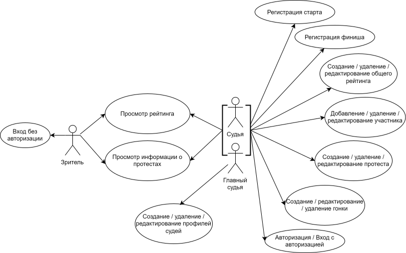
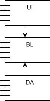

# PPO_BMSTU

# Как запускать это чудо с проксированием см. в "C:\nginx-1.27.2\PPO_BMSTU\README.md" 


## Название проекта

Администрирование парусных гонок.

## Краткое описание идеи проекта

С целью структурирования и организации доступа к результатам соревнований по парусному спорту необходимо создать приложение, которое обеспечит: добавление участников, организацию данных о результатах гонок, протестах, составление рейтинга.

## Краткое описание предметной области

Соревнования по парусному спорту проходят в течение n дней, в каждый из которых проводится по m гонок. Порядок финиширования яхт каждого класса фиксируется представителем судейского комитета: номер прихода - количество присваеваемых баллов. По полученным данным составляется таблица и подводятся итоги: чем меньше баллов в сумме, тем выше рейтинг участника. Кроме того, финишируя спортсмены могут подать "протест" на своих оппонентов.

## Краткий анализ аналогичных решений по минимум 3 критериям

|Решенине\Критерий| наличие информации о протестах | возможность просмотра рейтинга участниками | создание рейтинга произвольной конфигурации и подсчет результатов согласно ППГ 2021-2024 | гонки с пересадкой, флотов, крейсерские |
|-|--------|--------|--------|--------|
| SailingRaces | - | - | + | + |
| предлагаемое решение | + | + | + | - |

## Краткое обоснование целесообразности и актуальности проекта

В настоящее время мощный импульс развития получил парусный спорт вследствие того, что данная дисциплина практически не предполагает возрастных ограничений. Актуальность данной темы обоснована тем, что спортсмены повышают свой уровень, учавствуя в соревнованиях и нуждаются в эффективных механизмах анализа динамики гонок. Существует приложение для создания рейтинга, однако в нем полностью отсутствует возможность просматра участниками таблицы результатов и информации о протестах. Разработанное приложение должно упростить получение актуальных данных спортсменами.

## Краткое описание акторов (ролей)

В проекте определены следующие роли:

- _зритель_ - люди, которые хотят просмотреть рейтинги регаты, информацию о гонках, командах, протестах;
- _судья_ - люди из судейского комитета, которые добавляют участников соревнований, экипажи; создают и изменяют данные, доступные для зрителя: рейтинги, информацию о протестах, гонках;
- _старший судья_ - главный член судейского комитета, который помимо возможностей обычного судьи может создавать профили судей.

## Use-Case - диаграмма

  

## ER-диаграмма сущностей

  

## Пользовательские сценарии

1. **Зритель просматривает рейтинговую таблицу.**
   - открывает сайт;
   - переходит на вкладку с рейтингом "Веселый ветер" класса яхт "Луч";
   - просматривает содержимое рейтинга. 

2. **Судья принимает финиш.**
   - заходит в систему;
   - переходит на вкладку с рейтингом "Веселый ветер" класса яхт "Луч";
   - переходит ко второй гонке;
   - переходит на вкладку финишной процедуры;
   - фиксирует номера парусов, пересекших финишную черту по порядку;
   - по окончании приема финиша запускает процесс конвертации данных из составленного списка финишировавших лодок в баллы каждой яхты в рейтинге.

3. **Главный судья создает профиль судьи.**
    - заходит в систему;
    - переходит к панели управления судьи;
    - заполняет данные о новом судье (ФИО, роль, должность, логин, пароль);
    - добавляет нового судью.

4. **Судья создает протест**
   - заходит в систему;
   - переходит на вкладку четвертого дня;
   - переходит на вкладку класса яхт "Кадет";
   - переходит на вкладку десятой гонки; 
   - переходит на вкладку списка протестов;
   - создает новый протест, фиксируя номер нарушенного правила, номер яхты, которая подала протест, номер опротестованной яхты, номера яхт - свидетелей;
   - обновляется список протестов;
   - переход на вкладкку списка протестов.

5. **Судья создает участника.**
   - заходит в систему;
   - переходит на вкладку участников;
   - проверяет наличие и валидность документов отправленных участником: 
   - добавляет нового участника, внося его ФИО, спортивный разряд, пол, возраст, статус(рулевой / не рулевой), информацию о тренере. 

6. **Судья изменяет количество выбрасываемых результатов.**
   - заходит в систему, авторизуясь;
   - переходит на вкладку рейтинга нужного класса яхт;
   - увеличивает количество результатов, которые не учитываются в зачете на 1;
   - рейтинг обновляется;
   - отображается обновленный рейтинг.

## Формализация ключевых бизнес-процессов

 
  
  
  

## Технологический стек

- Тип приложения: Web MPA
- Backend: Go
- Frontend: HTML + CSS + TS
- Database: PostgreSQL

## Верхнеуровневое разбиение на компоненты

Приложение будет состоять из трех компонентов:
- реализация пользовательского интерфейса - user interface - UI;
- бизнес логика - buisness logic - BL;
- доступ к данным - data access - DA.

## UML диаграмма компонентов
  

## UML диаграмма классов для компонентов доступа к данным и бизнес логики
  

## Mood board

https://ru.pinterest.com/vylegzhaninaalena/sailraces/

## Макет приложения в figma

# Сборка докер образа
```
docker-compose -f docker-composeWeb.yml build --no-cache  
docker-compose -f docker-composeWeb.yml up  
```

# Сборка докер образа из образов в docker hub
```
docker-compose -f docker-composeWeb.yml pull  
docker-compose -f docker-composeWebHub.yml up  
```

