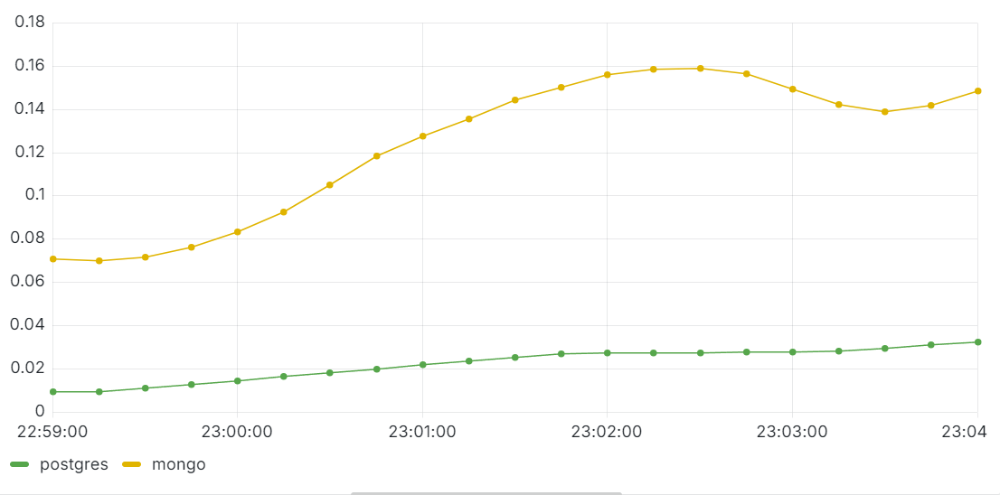
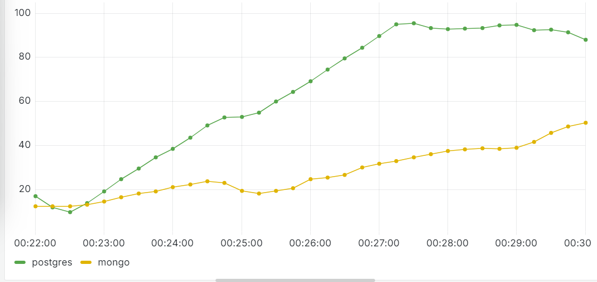
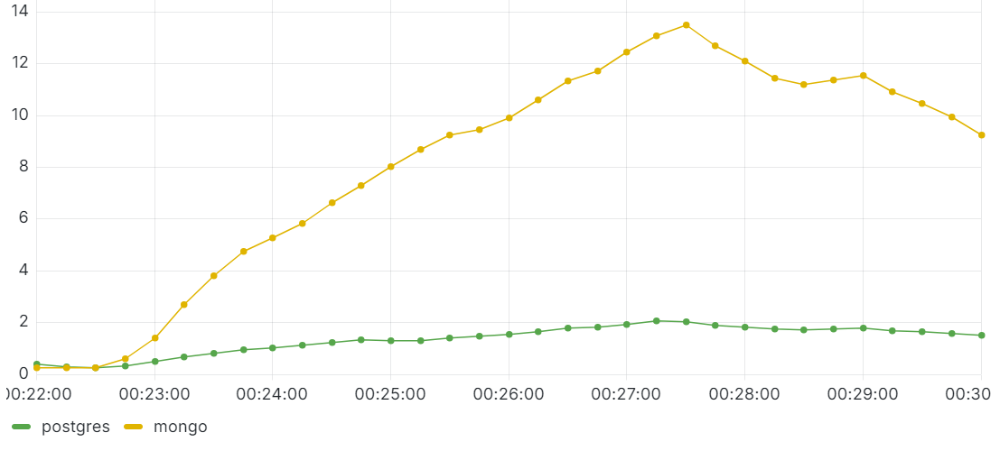

# Отчет по оценке производительности

## 1. Введение
### Цель тестирования:

  Оценить производительность операций чтения/записи при одновременной работе множества клиентов.

### Объекты исследования:

  СУБД Mongo и Postgres.

- **Описание тестового окружения:**
    - Версия Docker: 3.8
    - Используемые инструменты: Locust + Prometheus + Grafana

---

## 2. Методология
- **Среда тестирования:**
    - Одинаковые Docker-образы для каждого прогона
- **Ограничения контейнеров:**
  - CPU: 1 
  - RAM: 2G
- **Оцениваемые параметры:**
    - Время выполнения операций
    - Утилизация ресурсов (CPU, RAM, Диск)
    - Задержки и перцентили

---

## 3. Описание тестов
### 3.1 Сценарии тестирования
- **Тест на конкурентные операции записи**

- **Тест на конкурентные операции чтения**
[mongo_benchmark_test.py](mongo_read_test.py)
[psql_benchmark_test.py](psql_read_test.py)
- **Тест на конкурентные операции записи + чтения**

### 3.2 Подготовка тестового окружения
- **Docker-конфигурация:**
  [docker-compose.yml](docker-compose.yml)
- **Настройка Prometheus:**
  [prometheus.yml](prometheus.yml)

---

## 4. Результаты тестов

Графики и запросы для Docker-контейнеров в Grafana:
Параметр	PromQL-запрос
- CPU Usage (%)	
  - sum(rate(container_cpu_usage_seconds_total{name="postgres"}[5m])) * 100
  - sum(rate(container_cpu_usage_seconds_total{name="mongo"}[5m])) * 100 
- RAM Usage (MB)	
  - container_memory_usage_bytes{name="postgres"} / 1024 / 1024
  - container_memory_usage_bytes{name="mongo"} / 1024 / 1024
- Network Inbound (MB)	
  - rate(container_network_receive_bytes_total{name="postgres"}[5m]) / 1024 / 1024
  - rate(container_network_receive_bytes_total{name="mongo"}[5m]) / 1024 / 1024
- Network Outbound (MB)	
  - rate(container_network_transmit_bytes_total{name="postgres"}[5m]) / 1024 / 1024
  - rate(container_network_transmit_bytes_total{name="mongo"}[5m]) / 1024 / 1024

### 4.1. Тест на конкурентные операции записи

#### 4.1.1. Время выполнения операций
| **MongoDB**                               | **PostgreSQL**                       |
|-------------------------------------------|--------------------------------------|
|  |  |

#### 4.1.2 Утилизация ресурсов
- **CPU Usage (%):**

- **RAM Usage (MB):**

- **Network:**
  - Inbound (MB):

  - Outbound (MB):

### 4.2. Тест на конкурентные операции чтения

#### 4.2.1. Время выполнения операций
| **MongoDB**                          | **PostgreSQL**                       |
|--------------------------------------|--------------------------------------|
|  |  |

#### 4.2.2. Утилизация ресурсов
- **CPU Usage (%):**
  
- **RAM Usage (MB):**
  
- **Network:**
  - Inbound (MB):
  
  - Outbound (MB):
  

### 4.3.

#### 4.3.1. Время выполнения операций
| **MongoDB**                          | **PostgreSQL**                       |
|--------------------------------------|--------------------------------------|
|  |  |

#### 4.3.2. Утилизация ресурсов
- **CPU Usage (%):**

- **RAM Usage (MB):**

- **Network:**
  - Inbound (MB):

  - Outbound (MB):

---
