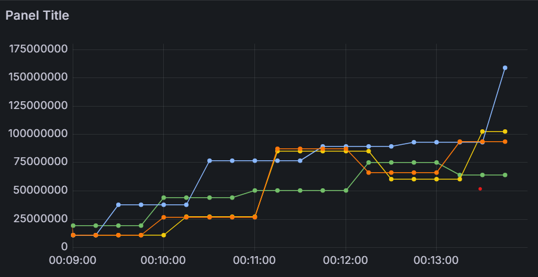
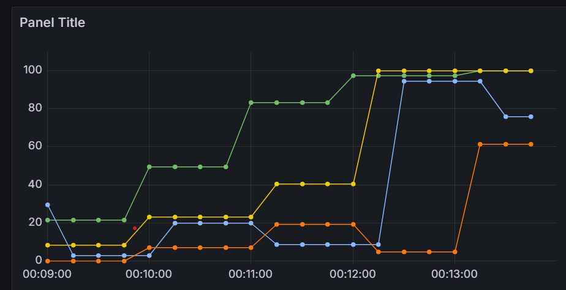

# Лабораторная работа №5 по тестированию

Тестирование проводилось с помощью locust. 
Был запущен бенчмарк в рамках которого производился get запрос к html странице рейтинга.
Прирост пользователей в секунду - 10, максимальное количество запросивших страницу пользователей - 2000.
Поочередно бенчмарк запускался для сервера с запущенным логгированием и трассировкой, только логгированием / трассировкой, без логгирования/трассировки.

## Memory usage

- С трассировкой
- С логгированием
- Без логгирования и трассировки
- C логгированием и трассировкой

## CPU usage

- Без логгирование и трассировки
- С логгированием и трассировкой
- С логгированием
- С трассировкой

В CI/CD результаты фиксирования метрик использования memory и cpu сохраняются как артефакт